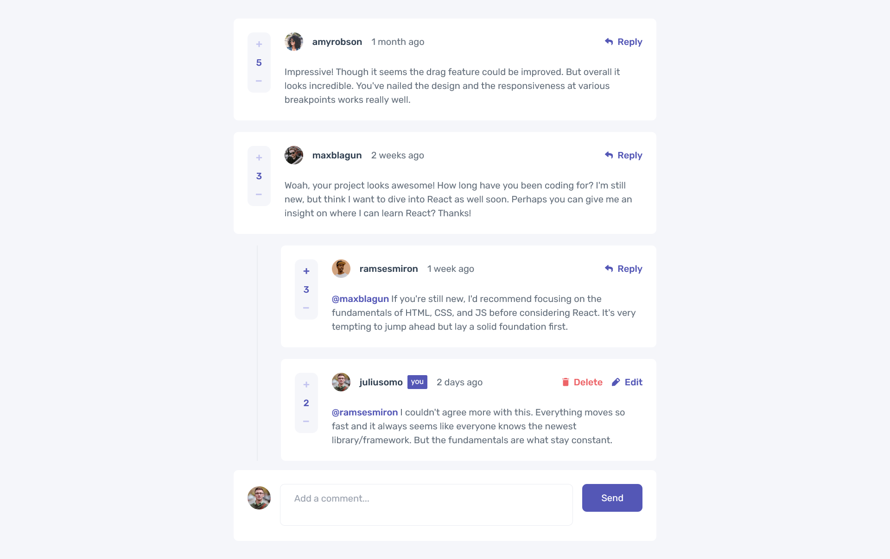

# Frontend Mentor - Interactive comments section solution

This is a solution to the [Interactive comments section challenge on Frontend Mentor](https://www.frontendmentor.io/challenges/interactive-comments-section-iG1RugEG9). Frontend Mentor challenges help you improve your coding skills by building realistic
projects.

- Live Site URL: [GitHub Pages](https://bohdancho.github.io/interactive-comments-section/)

## Table of contents

- [Overview](#overview)
  - [The challenge](#the-challenge)
  - [Screenshot](#screenshot)
- [My process](#my-process)
  - [Built with](#built-with)
  - [What I learned](#what-i-learned)

## Overview

### The challenge

Users should be able to:

- View the optimal layout for the app depending on their device's screen size
- See hover states for all interactive elements on the page
- Create, Read, Update, and Delete comments and replies
- Upvote and downvote comments
- **Bonus**: If you're building a purely front-end project, use `localStorage` to save the current state in the browser that persists when the browser is refreshed.
- **Bonus**: Instead of using the `createdAt` strings from the `data.json` file, try using timestamps and dynamically track the time since the comment or reply was posted.

### Screenshot



## My process

### Built with

- Typescript
- React
- Tailwind CSS
- CSS Grid
- Mobile-first workflow

### What I learned

I'm happy with my first React pet-project and ready to move on to more challenging projects. Apart from the suggested functions I also implemented the following:

- comments display the upvote/downvote of the user
- clicking on Reply/Edit closes other active replies/edits

I liked using Context to pass down both the data state and the dispatcher for it:

```tsx
const [data, dispatchData] = useReducer<DataReducer>(dataReducer, null)

<DataDispatchContext.Provider value={dispatchData}>
  <DataContext.Provider value={data}>{children}</DataContext.Provider>
</DataDispatchContext.Provider>
```
